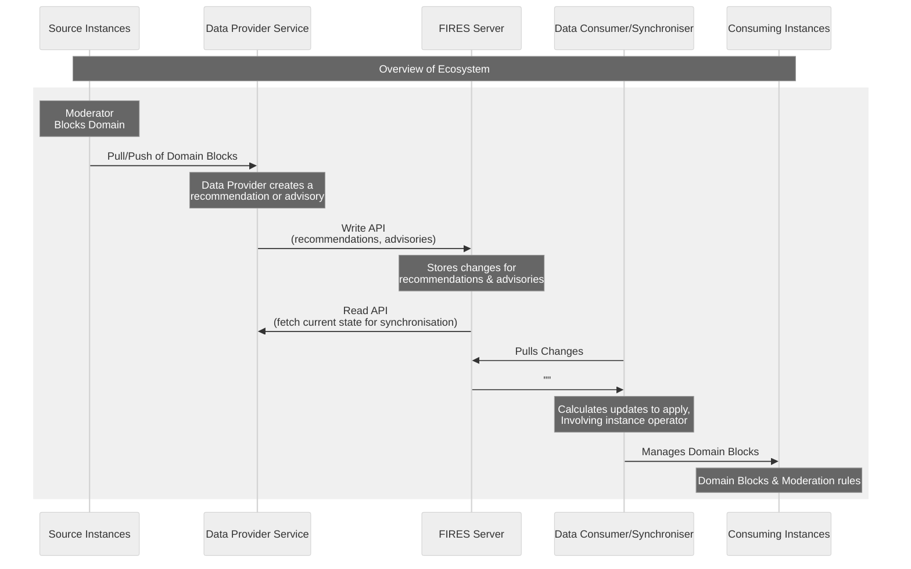
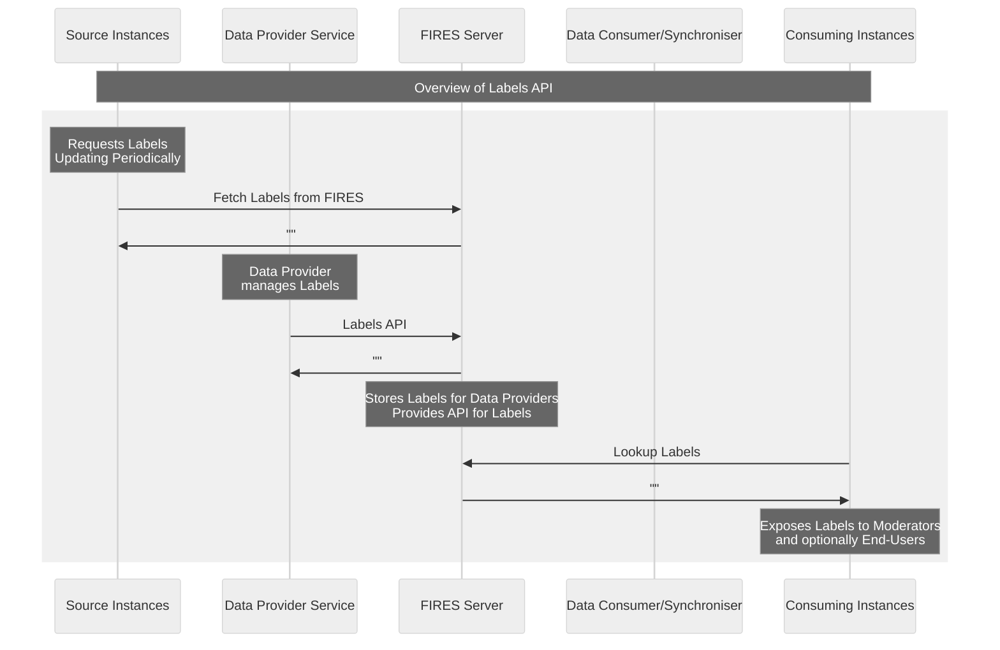

# Goals & Objectives

This proposal aims to develop a small server that can be integrated with by [Data Providers](../terms/data-provider) allowing them to publish moderation advisories and recommendations via an API that allows for resumable consumption of the data, with the full changelog of the data being made available by the server. The data made available by this server is designed to be structured data, suitable for machine consumption, allowing it to be surfaced via tools and user interfaces.

Data Providers are individuals, groups, or organisations who currently maintain denylists, conduct & publish threat intelligence research, or handle other matters related to coordinating and improving the trust and safety of the fediverse.

We take the stance that consumers (instance operators or end-users) of the information published to a FIRES server by [Data Providers](../terms/data-provider) should ultimately decide which moderation action to take in response to the data published.

In more definitive terms: **FIRES only provides moderation advisories and recommendations, rather than prescribing that a given action must be taken**. This is in contrast to the current status quo with denylists which are very prescriptive about what action must be taken.

**FIRES is not designed for creation of denylists**, and although you could use it for that purpose, the intended way of using the data is not through bulk automated imports of data, instead we encourage instance operators to review the data contained and to make their own decisions based upon the data.

**FIRES is not for a centralised service**, but instead it is designed to be hosted by data providers who then integrate with it to supply their data to downstream [consumers](../terms/data-consumer). Whether those providers are providing data to reduce illegal content, racism, transphobia, or other bigotry is entirely up to them, and how they source & manage their data is entirely up to them.

Other software should integrate with the server and consume the published data, handling the application of advisories and recommendations to downstream instances, ideally with a workflow that actively involves the instance operator.

For instance, software _could_ be written to selectively apply recommendations based on configured needs using the labels associated with the moderation advisories or recommendations, adjusting the acceptance of recommended actions and filters as necessary for that consumer. Software _could_ also be written to allow downstream consumers to decide to implicitly trust & accept the recommendations provided and apply the actions and filters recommended automatically, even though this is discouraged.

> [!INFO] Software Implementer Note
> If downstream software chooses to apply their own rulings based on the data, then they should ensure that any changes published with the `recommended_action` of “none” or that have a type of “retraction” should have them re-evaluate their rulings, as these are **retractions of a previous advisory or recommendation**.

**FIRES is also not designed to be a user-facing website or application**, instead it is a tool that data providers can integrate with to simplify the change tracking and distribution of their moderation recommendations and advisories. The only optional component that can be user-facing is the [Label Provider](../terms/label-provider), but we also encourage you to proxy or host this directly via your platform for moderation data.

This is in contrast with existing domain denylists and how they are distributed, which are highly prescriptive: “you must block this domain because we say”. Generally, there is no mechanism through which to reject a denylists’ rulings as you lack the information to help you decide and fediverse tooling often doesn’t provide you a choice, unless you manually edit the CSV file by hand or pre-process it in some way, which as noted can be difficult based on the lack of data presented in existing denylists.

Some fediverse software may prevent importing domain blocks from denylist CSV files if doing so would cause relationships to be severed, but this is a relatively new functionality that is not widely available across different fediverse software.

To give an idea of how the proposed server fits into the wider ecosystem of moderation tooling in the Fediverse, the end-to-end ecosystem could look something like the following:

### Moderation Data

 

### Labels

 

